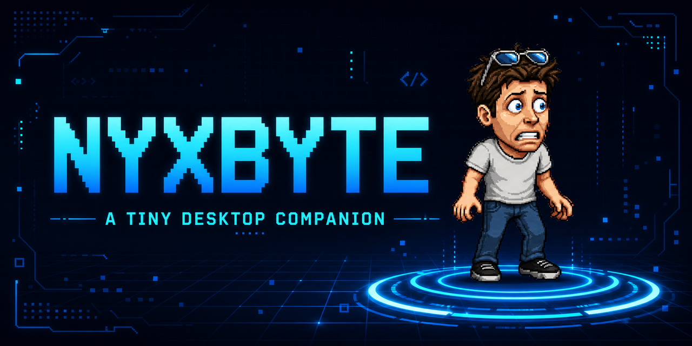
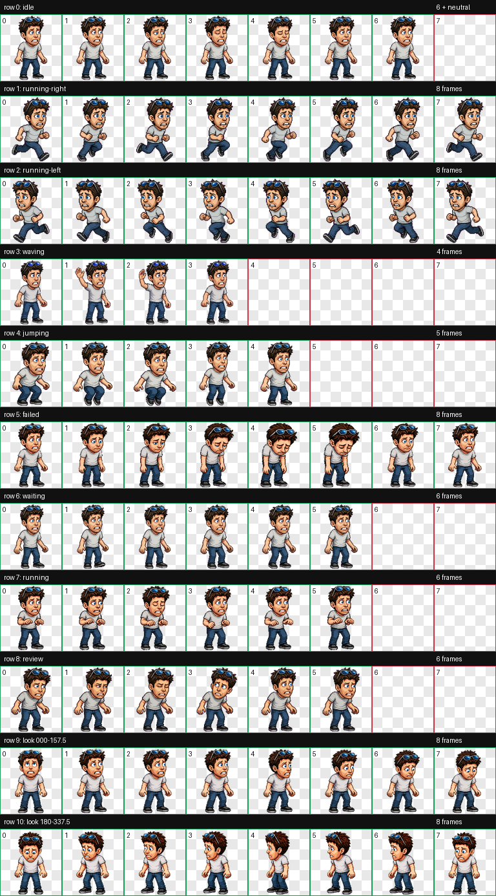

# Nyxbyte

<p align="center">
  
</p>

<p align="center">
  <a href="https://github.com/RealNumNums/Nyxbyte/actions/workflows/build.yml"></a>
  <a href="https://github.com/RealNumNums/Nyxbyte/releases/latest"></a>
  <a href="https://github.com/RealNumNums/Nyxbyte/releases"></a>
  <a href="LICENSE"></a>
  <a href="https://github.com/RealNumNums/Nyxbyte/stargazers"></a>
</p>

Nyxbyte is a tiny animated Windows desktop companion written in modern C++.
He roams over your apps, waves, jumps, focuses, reviews, and generally keeps
your desktop company without needing an installer or a background service.

<p align="center">
  <strong><a href="https://github.com/RealNumNums/Nyxbyte/releases/latest">Download Nyxbyte for Windows</a></strong>
  ·
  <a href="https://github.com/RealNumNums/Nyxbyte/discussions">Join the community</a>
  ·
  <a href="https://github.com/RealNumNums/Nyxbyte/issues/new/choose">Suggest a feature</a>
</p>

## Features

- Transparent native Win32 overlay
- Smooth sprite animation and ambient roaming
- Drag positioning and three display scales
- Always-on-top and click-through modes
- Tray icon with animation and behavior controls
- Separate `ICompanionBrain` interface for future AI features
- No telemetry, account, network connection, or installer

<details>
<summary><strong>See every animation state</strong></summary>



</details>

## Install

1. Open the [latest release](https://github.com/RealNumNums/Nyxbyte/releases/latest).
2. Download `Nyxbyte-v0.1.0-windows-x64.zip`.
3. Extract the whole ZIP.
4. Run `Nyxbyte.exe`.

Keep the `assets` folder beside the executable. Windows may show a SmartScreen
prompt because this hobby release is not code-signed; choose **More info** and
**Run anyway** only if you downloaded it from this repository.

## Controls

- Drag Nyxbyte with the left mouse button.
- Click Nyxbyte to make him wave.
- Double-click to toggle roaming.
- Right-click Nyxbyte or his tray icon for the full menu.
- Press `Ctrl+Alt+N` to toggle click-through mode.
- Use the tray menu to exit while click-through is enabled.

## Build from source

Requirements:

- Windows 10 or newer
- Visual Studio 2022 Build Tools with the Desktop C++ workload
- CMake 3.24 or newer

From a Developer PowerShell:

```powershell
cmake -S . -B build -G "Visual Studio 17 2022" -A x64
cmake --build build --config Release --parallel
```

The executable and its copied assets will be under `build\Release`.

## Architecture

```text
assets/                 Runtime sprite atlas and application icon
include/nyxbyte/        Replaceable companion-brain interface
src/ambient_brain.cpp   Current offline ambient behavior
src/main.cpp            Win32 window, rendering, animation, and controls
```

The renderer and `ICompanionBrain` are intentionally separate. A future brain
can add an opt-in AI service, local model, reminders, notifications, speech, or
app-aware tools without replacing the window and animation system.

## Roadmap

- Local notifications and timers
- Optional AI connector behind an explicit permissions layer
- Speech and customizable personalities
- More pets, animation packs, and themes

## Help Nyxbyte grow

If Nyxbyte made your desktop a little less lonely, consider giving the
repository a ⭐. Stars help other desktop-pet fans and C++ developers discover
the project. Bug reports, animation ideas, and pull requests are welcome too.

Contributions and forks are welcome. See [CONTRIBUTING.md](CONTRIBUTING.md).

The bundled character artwork began as the supplied Mini Sama Codex pet and is
distributed here as part of this project. Nyxbyte is an unofficial fan-made
project and is not affiliated with or endorsed by OpenAI.

Licensed under the [MIT License](LICENSE).
